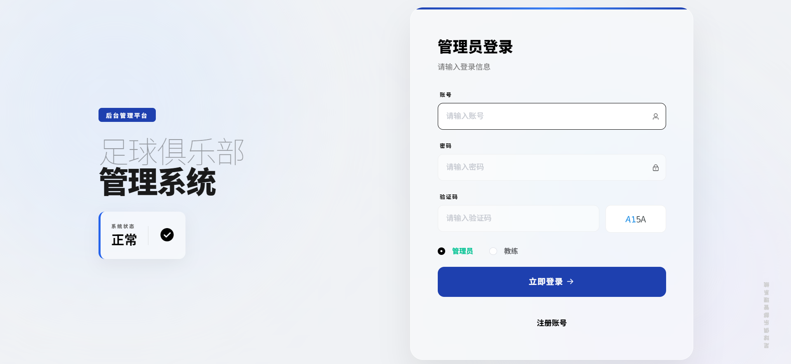

# 足球俱乐部管理系统

基于 Spring Boot + MyBatis-Plus + Vue 的足球俱乐部综合管理平台。

## 项目介绍

面向足球俱乐部的信息化管理系统，覆盖俱乐部日常运营中的核心业务场景：赛事管理、公告发布、教练与球员管理、训练计划制定、球员数据统计、合同管理等。

**项目定位**：单体 Spring Boot 应用，前后端半分离架构，适合中小型俱乐部快速部署使用。

**双前端架构**：

- **前台门户**（`front/front/`）：原生 HTML + Vue.js (CDN) + Layui，纯静态页面，Spring Boot 直接提供服务，无需构建
- **后台管理**（`admin/admin/`）：Vue 2 + Element UI + Vue Router，Webpack 打包，开发时支持热更新（端口 8081，代理到后端 8080）

## 🌐 在线体验（公网可访问）

> 部署环境：阿里云 ECS（Ubuntu 22.04 / 2核2G / MySQL 5.7 + Redis）

| 系统 | 访问地址 | 说明 |
|------|----------|------|
| 🏠 **前台门户** | http://120.26.174.97:8080/zuqiujulebguanli/front/index.html | 公告、赛事、足球资讯，无需登录 |
| 🔧 **后台管理** | http://120.26.174.97:8080/zuqiujulebguanli/admin | 完整管理后台，需登录 |

**测试账号（演示环境）：**

| 角色 | 账号 | 密码 | 权限范围 |
|------|------|------|----------|
| 演示访客 | `demo_viewer` | `demo123` | 只读浏览（公告、赛事、门户页面） |

> 生产/公网环境请勿暴露管理员全权限账号。本地开发可使用 `application-dev.yml` 配置完整测试数据。

## 📸 系统截图

### 前台门户（Layui + Vue.js）

面向普通用户和球迷的信息展示页面，包含公告列表、赛事卡片、足球资讯等模块。纯静态 HTML，无需登录即可浏览。


### 后台管理（Vue 2 + Element UI）

**登录页** — 支持管理员 / 教练 / 球员三种角色登录，含验证码校验：



**管理仪表盘** — 数据统计卡片、最新公告、最新赛事一览：


## 技术栈

| 层次 | 技术 | 版本 |
|------|------|------|
| 框架 | Spring Boot | 3.3.7 |
| JDK | Java | 17 |
| ORM | MyBatis-Plus | 3.5.7 |
| 数据库 | MySQL | 5.7+ |
| 缓存 | Redis | 5.0+（字典数据缓存，不可用时自动降级） |
| 连接池 | HikariCP | (Spring Boot 内置) |
| 鉴权 | 自研 Token 拦截器 | AuthorizationInterceptor |
| 模板引擎 | Thymeleaf | (Spring Boot 内置) |
| JSON | FastJSON2 | 2.0.53 |
| AI | DeepSeek / OpenAI 兼容 API + Function Calling | 6 类业务工具 |
| 工具库 | Hutool | 5.8.25 |
| 后台前端 | Vue 2 + Element UI + Vue Router | (CDN + Webpack 打包) |
| 前台前端 | 原生 HTML + Vue.js (CDN) + Layui | — |
| 构建工具 | Maven (后端) / Webpack (前端) | — |
| 工程化 | Docker Compose + GitHub Actions CI | — |

## 目录结构

```
zuqiu/
├── pom.xml                                  # Maven 配置
├── db.sql                                   # 数据库初始化脚本
├── README.md
├── docs/                                    # 项目文档
│   ├── sql-optimization.md                  # SQL 优化分析
│   ├── deploy.md                            # 部署指南
│   └── screenshots/                         # 系统截图
├── .vscode/                                 # VS Code 配置
├── src/main/java/com/
│   ├── ZuqiujulebguanliApplication.java     # 应用启动入口
│   ├── annotation/                          # 自定义注解 (@ColumnInfo, @IgnoreAuth)
│   ├── common/                              # 公共类
│   │   ├── BusinessException.java           # 业务异常
│   │   ├── ResultCode.java                  # 统一响应状态码枚举
│   │   └── GlobalExceptionHandler.java      # 全局异常处理器
│   ├── config/
│   │   ├── MybatisPlusConfig.java           # MyBatis-Plus 分页插件配置
│   │   ├── RedisConfig.java                 # Redis 序列化配置
│   │   └── WebMvcConfig.java                # Web MVC 配置(拦截器/静态资源)
│   ├── controller/                          # REST 控制器 (10 个模块)
│   │   ├── ConfigController.java
│   │   ├── DictionaryController.java
│   │   ├── ExternalNewsController.java
│   │   ├── FileController.java
│   │   ├── GonggaoController.java           # 公告
│   │   ├── HetongController.java            # 合同
│   │   ├── JiaolianController.java          # 教练
│   │   ├── SaishiController.java            # 赛事 (核心模块)
│   │   ├── ShujuController.java             # 球员数据
│   │   ├── UsersController.java             # 管理员
│   │   ├── XunlianController.java           # 训练计划
│   │   └── YonghuController.java            # 用户/球员
│   ├── dao/                                 # MyBatis-Plus Mapper 接口
│   ├── entity/                              # 数据库实体 (对应表)
│   │   └── view/                            # 视图对象 (带字典翻译字段)
│   ├── service/                             # 业务接口
│   │   ├── DictionaryCacheService.java      # Redis 字典缓存服务（含降级策略）
│   │   └── impl/
│   │       ├── BaseService.java             # 抽象基类 (模板方法模式)
│   │       ├── GonggaoServiceImpl.java
│   │       ├── SaishiServiceImpl.java       # 赛事服务 (逻辑删除示例)
│   │       └── ...
│   ├── interceptor/
│   │   └── AuthorizationInterceptor.java    # 登录鉴权拦截器
│   ├── listener/
│   │   └── DictionaryServletContextListener.java  # 字典表初始化监听器
│   └── utils/
│       ├── R.java                           # 统一响应封装 (继承 HashMap)
│       ├── PageUtils.java                   # 分页工具
│       ├── Query.java                       # 查询参数封装
│       ├── MPUtil.java                      # MyBatis-Plus 工具
│       ├── CommonUtil.java                  # 通用工具
│       ├── DateUtil.java                    # 日期工具
│       ├── SQLFilter.java                   # SQL 注入过滤
│       └── StringUtil.java                  # 字符串工具
├── src/main/resources/
│   ├── application.yml                      # 主配置文件 (数据源/端口/MyBatis-Plus)
│   ├── mapper/                              # MyBatis XML 映射文件 (9 个)
│   │   └── SaishiDao.xml                    # 赛事动态 SQL 查询
│   ├── front/front/                         # 前台静态页面 (无需构建)
│   │   ├── index.html                       # 首页
│   │   ├── pages/                           # 各模块页面
│   │   └── js/ config.js modules/           # 前端配置
│   ├── admin/
│   │   ├── admin/                           # 后台 Vue 项目源码
│   │   │   ├── package.json
│   │   │   ├── vue.config.js                # Vue CLI 配置 (outputDir/dist 路径)
│   │   │   └── src/
│   │   │       ├── main.js                  # Vue 入口
│   │   │       ├── router/router-static.js  # 路由定义
│   │   │       ├── utils/http.js            # axios 封装
│   │   │       └── views/modules/           # 各模块页面组件
│   │   └── dist/                            # Webpack 构建输出 (git ignored)
│   └── static/upload/                       # 上传文件目录
└── target/                                  # Maven 编译输出
```

## 后端启动步骤

### 环境要求
- JDK 17
- Maven 3.6+
- MySQL 5.7+（已安装并运行）
- Redis 5.0+（可选，字典缓存；不可用时自动降级到内存缓存）

复制环境变量模板：

```bash
cp .env.example .env
# 编辑 .env，至少设置 DB_PASSWORD 和 DEEPSEEK_API_KEY
```

### 1. 创建数据库并导入数据

在 MySQL 中执行：

```bash
# 创建数据库
mysql -u root -p -e "CREATE DATABASE IF NOT EXISTS zuqiujulebguanli DEFAULT CHARACTER SET utf8mb4 COLLATE utf8mb4_general_ci;"

# 导入数据
mysql -u root -p zuqiujulebguanli < db.sql
```

> **注意**：`db.sql` 文件开头有 BOM 头可能导致导入报错。如遇到 `1064` 语法错误，先用 VS Code / Notepad++ 将文件编码转为 UTF-8 without BOM。

### 2. 修改数据库连接

编辑 `src/main/resources/application.yml` 或使用环境变量：

```yaml
spring:
  datasource:
    url: ${DB_URL}
    username: ${DB_USERNAME}
    password: ${DB_PASSWORD}
```

### 3. 编译运行

```bash
# 方式一：Maven 命令行
mvn clean package -DskipTests
java -jar target/zuqiujulebguanli-0.0.1-SNAPSHOT.jar

# 方式二：IDE 运行
# 在 IDEA 中直接运行 ZuqiujulebguanliApplication.main()
```

### 4. 访问验证

- 后端启动端口：`8080`
- 上下文路径：`/zuqiujulebguanli`
- 前台首页：`http://localhost:8080/zuqiujulebguanli/front/index.html`
- 后台管理：`http://localhost:8080/zuqiujulebguanli/admin`
- 默认管理员：`manager` / `manager`

## 前端启动/打包步骤

### 后台管理系统 (Vue 2 + Element UI)

项目位于 `src/main/resources/admin/admin/`。

```bash
cd src/main/resources/admin/admin

# 安装依赖
npm install

# 开发模式 (热更新，端口 8081，代理到后端 8080)
npm run serve

# 生产构建 (输出到 ../dist/)
npm run build
```

`vue.config.js` 关键配置：
- `outputDir`: `../dist`（构建到 `src/main/resources/admin/dist/`）
- `devServer.port`: `8081`
- `devServer.proxy`: `/zuqiujulebguanli` → `http://localhost:8080`

### 前台展示页面（纯静态，无需构建）

位于 `src/main/resources/front/front/`，由 Spring Boot 直接提供静态资源服务。

| 页面 | 路径 | 说明 |
|------|------|------|
| 首页 | `index.html` | 导航入口，公告/赛事/资讯三栏布局 |
| 公告列表 | `pages/gonggao/list.html` | 公告卡片列表，支持类型筛选和搜索 |
| 公告详情 | `pages/gonggao/detail.html` | 公告正文展示 |
| 赛事列表 | `pages/saishi/list.html` | 赛事卡片列表，含封面图、类型筛选 |
| 赛事详情 | `pages/saishi/detail.html` | 赛事介绍、比赛信息 |
| 登录页 | `pages/login/login.html` | 前台用户登录 |
| 个人中心 | `pages/yonghu/center.html` | 球员个人信息管理 |

## API 接口说明

### 统一响应格式

所有接口返回 JSON，使用 `com.utils.R`（继承 `HashMap`）封装：

```json
// 成功
{ "code": 0, "data": {...}, "msg": "ok" }

// 成功(分页)
{ "code": 0, "data": { "total": 100, "pageSize": 10, "currPage": 1, "totalPage": 10, "list": [...] } }

// 错误
{ "code": 500, "msg": "错误信息" }

// 未登录
{ "code": 511, "msg": "未找到数据" }
```

### 通用 CRUD 接口模式

每个业务模块提供统一的 5 个接口：

| 方法 | 路径 | 功能 |
|------|------|------|
| GET | `/模块/page` | 分页查询（支持多条件筛选 + 时间范围） |
| GET | `/模块/info/{id}` | 查详情（含字典翻译） |
| POST | `/模块/save` | 新增（含唯一性校验 + 默认值） |
| POST | `/模块/update` | 修改（含字段清理） |
| POST | `/模块/delete` | 删除（物理删除 / 逻辑删除） |

### 分页查询参数

```
?page=1&limit=10&sort=id&order=desc
```

- `page`: 页码（默认 1）
- `limit`: 每页条数（默认 10）
- `sort`: 排序字段（默认 id）
- `order`: 排序方向（asc / desc，默认 desc）
- 其他字段：作为过滤条件，空值和 "null" 字符串自动忽略

## AI 智能助手

### 架构

```text
用户 -> /ai/chat -> AiChatService
                      ├─ AiProviderClient         (模型请求)
                      ├─ AiToolDefinitionService  (6 类工具定义)
                      ├─ AiToolExecutor           (真实数据库查询)
                      ├─ AiFallbackRouter         (模型漏调工具时兜底)
                      ├─ AiReplyFormatter         (后端确定性纯文本回复)
                      └─ AiExecutionRecorder      (工具/参数/耗时/结果记录)
```

### 6 类 Function Calling 工具

| 工具名 | 用途 |
|--------|------|
| `queryPlayers` | 球员档案查询 |
| `queryAnnouncements` | 公告查询 |
| `queryMatches` | 赛事查询 |
| `queryTrainingPlans` | 训练计划查询 |
| `queryContracts` | 合同查询（含同名球员消歧） |
| `queryPlayerData` | 球员数据记录查询 |

### 接口

`POST /zuqiujulebguanli/ai/chat`

```json
{ "message": "查最新赛事" }
```

返回：

```json
{ "code": 0, "data": { "reply": "最新赛事信息：..." } }
```

### 安全与限流

- API Key 通过环境变量 `DEEPSEEK_API_KEY` 注入，不写入仓库
- `/ai/chat` 对公网开放但带 IP 频率限制（默认 20 次/60 秒）
- 业务数据回复由 Java 后端格式化，避免模型编造系统数据

### 测试与评测

| 类型 | 位置 | 说明 |
|------|------|------|
| 单元测试 | `src/test/java/com/service/` | 回复格式化、关键词提取 |
| 离线评测 | `src/test/resources/ai/eval-dataset.json` | 固定问题集，不调真实模型 |
| 在线评测 | `AiOnlineEvaluator` | 需配置 API Key，每题重复 3 次观察稳定性 |

运行测试：

```bash
mvn test
```

当前自动化测试覆盖：回复格式化（5）、关键词提取（2）、离线评测集（15+）、Controller 接口（2）。

## 面试可讲模块

### 1. BaseService 模板方法设计模式

`com.service.impl.BaseService` 是 Service 层的抽象基类，定义了 9 个模板方法：

- **必须实现**：`selectListView`、`toView`、`checkUniqueness`
- **可选覆盖**：`sanitizeFields`、`initEntityForInsert`、`applyRoleFilter`、`setDeleteFilterParams`、`softDeleteBatch`

**亮点**：
- 将公共分页查询、字典转换、角色过滤逻辑提升到父类
- 子类只需实现 3 个方法即可完成 CRUD
- 符合「对扩展开放，对修改关闭」原则

### 2. 逻辑删除（软删除）

以赛事模块 (`SaishiServiceImpl`) 为例：

- 删除时（`softDeleteBatch`）：将 `saishi_delete` 从 1 改为 2
- 查询时（`setDeleteFilterParams`）：自动注入 `saishiDeleteStart=1, saishiDeleteEnd=1`
- 配合 MyBatis XML 中的 `<![CDATA[ and a.saishi_delete >= #{...} ]]>` 过滤已删除数据

### 3. MyBatis-Plus 自定义分页 + 动态 SQL

`SaishiDao.xml` 中的 `selectListView` 展示了：
- 动态 `<where>` 标签：前端传了参数才加条件
- `<![CDATA[]]>` 区间查询：防止 `>=` 被 XML 解析
- `order by ${params.sort} ${params.order}` 动态排序
- 防 SQL 注入：`SQLFilter.sqlInject()` 校验排序参数

### 4. View 视图模式 + 字典翻译

- Entity（`SaishiEntity`）：对应数据库表字段
- View（`SaishiView extends SaishiEntity`）：扩展了 `saishiValue` 字典翻译字段
- `DictionaryService.dictionaryConvert()`：查询时将 `saishiTypes=1` 翻译为 `saishiValue="中超联赛"`
- 避免多次连表查询，字典表数据通过启动监听器加载到内存

### 5. 全局异常处理

```java
@RestControllerAdvice
public class GlobalExceptionHandler {
    @ExceptionHandler(BusinessException.class)  // 业务异常 → 511
    @ExceptionHandler(Exception.class)          // 未知异常 → 500
}
```

### 6. Redis 字典缓存 + 降级策略

`DictionaryCacheService` 将字典数据缓存到 Redis Hash 结构中（key: `zuqiu:dict:{dic_code}`）：

- **启动时**：`DictionaryServletContextListener` 同时将字典数据写入 ServletContext（原方案）和 Redis
- **查询时**：`dictionaryConvert()` 优先读 Redis，返回 null 时自动降级到 ServletContext
- **变更时**：字典增删改操作同步刷新 Redis 和 ServletContext
- **降级策略**：每个 Redis 操作用 try-catch 包裹，失败后 30 秒内不重试，避免频繁报错
- **限制**：Redis 宕机期间的字典变更不会自动补偿，恢复后需重启应用或触发一次字典变更

详见 `docs/deploy.md` 中的 Redis 降级与恢复说明。

### 7. AI 可靠性与评测工程化

- 拆分模型调用、工具执行、兜底路由、确定性回复模块
- 建立固定评测集，覆盖精确查询、模糊姓名、多人同名、数据不存在、字段缺失、提示词攻击
- 分离离线后端测试与在线模型评测
- 记录工具选择、参数提取、事实一致性、兜底触发率与响应耗时

## 部署方式

### Docker Compose 一键启动

```bash
cp .env.example .env
docker compose up --build
```

服务启动后访问：`http://localhost:8080/zuqiujulebguanli/front/index.html`

### CI

GitHub Actions 在 push/PR 时自动执行 `mvn test`（见 `.github/workflows/ci.yml`）。

### 生产部署架构

```
Nginx (80/443)
├── /                    → 前端静态资源 (admin/dist + front/front)
├── /zuqiujulebguanli/   → 反向代理 → localhost:8080
└── /upload/             → 上传文件目录

Spring Boot (8080)
├── 内嵌 Tomcat
├── MySQL 连接
└── 文件上传处理
```

### 首次部署

```bash
# 1. 后端打包
mvn clean package -DskipTests

# 2. 前端打包
cd src/main/resources/admin/admin && npm run build

# 3. 上传 jar 到服务器
scp target/zuqiujulebguanli-0.0.1-SNAPSHOT.jar root@<服务器IP>:/opt/zuqiu/target/

# 4. 启动
ssh root@<服务器IP>
cd /opt/zuqiu/target
nohup java -jar zuqiujulebguanli-0.0.1-SNAPSHOT.jar > /opt/app.log 2>&1 &
```

### 前端热更新（无需重新打包 jar）

项目配置了 `spring.resources.static-locations: file:static/`，Spring Boot 会优先从 jar 同级目录的 `static/` 读取静态文件，覆盖 jar 内的同名文件。

**更新前台页面：**
```bash
scp -r src/main/resources/front/front/* root@<服务器IP>:/opt/zuqiu/target/static/front/
```

**更新后台管理：**
```bash
cd src/main/resources/admin/admin && npm run build
scp -r ../dist/* root@<服务器IP>:/opt/zuqiu/target/static/admin/dist/
```

上传后浏览器强制刷新（`Ctrl+Shift+R`）即可看到变化，**无需重启 Java 服务**。

## 项目规范

### 命名规范
- Controller: `XxxController` → `@RequestMapping("/xxx")`
- Service 接口: `XxxService extends IService<XxxEntity>`
- Service 实现: `XxxServiceImpl extends BaseService<XxxDao, XxxEntity, XxxView>`
- Dao: `XxxDao extends BaseMapper<XxxEntity>`
- Entity: `XxxEntity` → `@TableName("xxx")`
- View: `XxxView extends XxxEntity`

### 逻辑删除字段规范
- 未删除: `1`
- 已删除: `2`
- 查询时通过 `setDeleteFilterParams` 注入删除过滤条件

## 常见问题

### Q: 启动报 "Unknown database"
A: MySQL 中不存在 `zuqiujulebguanli` 数据库，先执行 `CREATE DATABASE` 并导入 `db.sql`。

### Q: 导入 db.sql 报 1064 语法错误
A: SQL 文件开头有 BOM 头（UTF-8 with BOM），用 VS Code 转存为 UTF-8 without BOM。

### Q: 前台页面 404
A: 正确路径是 `/front/index.html`，不是 `/front/front/index.html`。`application.yml` 中 `spring.resources.static-locations` 已映射 `classpath:front/`。

### Q: 后台管理页面空白
A: 需要先 `npm run build` 构建 admin 项目到 `admin/dist/` 目录。

### Q: multi-catch 编译报错
A: 项目已升级到 JDK 17 + Spring Boot 3.x，请确认 IDE 与 Maven 使用 JDK 17。
